<!-- Day: POKE 36879,27   Night: POKE 36879,14 : POKE 646,3 -->
<picture>
  <source media="(prefers-color-scheme: dark)" srcset="https://raw.githubusercontent.com/EvanWieland/EvanWieland/main/assets/boot-night.svg">
  <source media="(prefers-color-scheme: light)" srcset="https://raw.githubusercontent.com/EvanWieland/EvanWieland/main/assets/boot-day.svg">
  
</picture>

I'm Evan, and I like making small machines do big jobs, like rendering 4K video loops on a 6 GB laptop GPU, or writing BASIC on a Commodore VIC-20 that boots with 3,583 bytes free.

### worldloom

Give [worldloom](https://github.com/EvanWieland/worldloom) one still image and a prompt, and it renders a seamless 30–60 second loop that can play for hours, on local hardware. A local LLM writes the render prompt, LTX-2.5 animates the still, and the passage from the last frame back to the first is generated rather than cross-faded. Every stage is fingerprinted, so an interrupted run picks up where it stopped.


<sub>A take in progress: the 22B video model offloaded to system RAM (55 of 64 GiB in use) and the 6 GB GPU at 90%.</sub>

### Pudl

[Pudl](https://github.com/EvanWieland/Pudl) is a small compiled language I've been building since 2022. The lexer and parser are hand-written, LLVM handles code generation and optimization, and a program can run straight from source, compile to an object file, or link into C++. Programs start at `mast`, not `main`.

```pudl
func fact( int n ) : int {
  if n <= 1 {
    return 1
  }
  return n * fact( n - 1 )
}

func mast : int {
  print fact( 5 )
  return 0
}
```

Here's the LLVM IR Pudl prints for that program with `--print-ir`. Its optimization passes have rewritten `n <= 1` as `n < 2` and merged the two returns into one block with a phi node.

```llvm
; ModuleID = 'pudl compiler'
source_filename = "pudl compiler"

@.formati = private constant [4 x i8] c"%d\0A\00"
@.formatf = private constant [4 x i8] c"%f\0A\00"

declare i32 @printf(ptr, ...)

define i32 @fact(i32 %n) {
entry:
  %0 = icmp slt i32 %n, 2
  br i1 %0, label %common.ret, label %Else

common.ret:                                       ; preds = %entry, %Else
  %common.ret.op = phi i32 [ %3, %Else ], [ 1, %entry ]
  ret i32 %common.ret.op

Else:                                             ; preds = %entry
  %1 = add nsw i32 %n, -1
  %2 = call i32 @fact(i32 %1)
  %3 = mul i32 %2, %n
  br label %common.ret
}

define i32 @mast() {
entry:
  %0 = call i32 @fact(i32 5)
  %1 = call i32 (ptr, ...) @printf(ptr noundef nonnull dereferenceable(1) @.formati, i32 %0)
  ret i32 0
}
```

### Brezia

[Brezia](https://github.com/brezia/brezia) is an open-source approval layer for AI agents. Routine tool calls like reads and searches clear on their own under a policy you write once, the ones that need a person wait in a local inbox, and every decision goes into a hash-chained audit log. It works with Claude Code, runs entirely on localhost, and if the daemon goes down, the agent falls back to its own permission prompts.

<a href="https://github.com/brezia/brezia"></a>

<sub>Three agent sessions share one queue. A curl call carrying a credential is denied with a reason, and two code edits are approved.</sub>

### Earlier

- [brute](https://github.com/EvanWieland/brute) runs brute-force attacks on encrypted HFS+ drives from the command line, and installs with Homebrew.
- [Shady](https://github.com/EvanWieland/Shady) puts glasses on faces with OpenCV and C++.
- [Snitch](https://github.com/EvanWieland/Snitch) is a small image-recognition model built with TensorFlow.
- [cordova-plugin-wayfarer](https://github.com/EvanWieland/cordova-plugin-wayfarer) infers what someone is doing from device motion, and [cordova-plugin-netto](https://github.com/EvanWieland/cordova-plugin-netto) tracks network usage.

Reach me at [evan@bitsmithy.io](mailto:evan@bitsmithy.io) or on [LinkedIn](https://www.linkedin.com/in/evan-w/).
